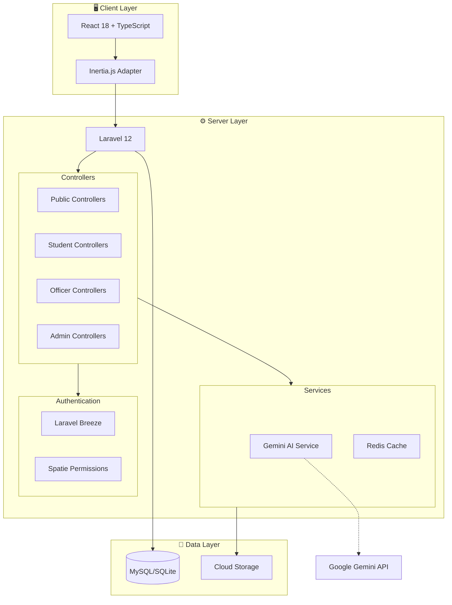
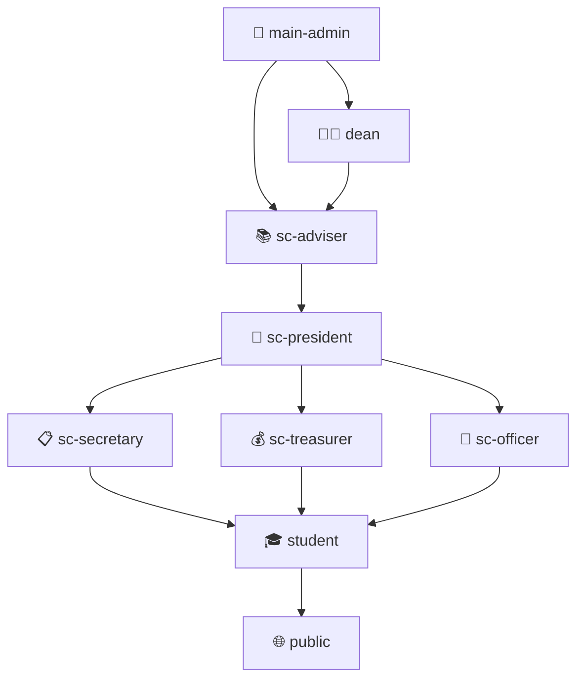

<p align="center">
  
</p>

<h1 align="center">🎓 CICT Tech Portal</h1>

<p align="center">
  <strong>A comprehensive student council management system built for academic institutions</strong>
</p>

<p align="center">
  <a href="#features">Features</a> •
  <a href="#technology-stack">Tech Stack</a> •
  <a href="#architecture">Architecture</a> •
  <a href="#installation">Installation</a> •
  <a href="#configuration">Configuration</a> •
  <a href="#contributing">Contributing</a> •
  <a href="#license">License</a>
</p>

<p align="center">
  
  
  
  
  
  
</p>

---

## 📋 Overview

The **CICT Tech Portal** is a full-featured student council management platform designed for colleges and universities. It streamlines organizational operations through role-based dashboards, AI-powered assistance, event management, and comprehensive financial tracking.

Originally built for the **ISUFST College of Information and Computing Technology (CICT) Student Council**, this system is fully customizable and can be white-labeled for any educational institution.

### 🎯 Perfect For

- 🏫 **Universities & Colleges** - Centralized student organization management
- 🎓 **Student Councils** - Officer duty tracking, meeting notes, financial records
- 🏫 **Academic Departments** - Announcement systems, event calendars, enrollment
- 💼 **Investors** - Turnkey SaaS solution for educational institutions

---

## ✨ Features

### 🌐 Public Portal
| Feature | Description |
|---------|-------------|
| 🏠 **Glassmorphic Landing Page** | Premium dark-mode design with animated hexagonal patterns |
| 📢 **Announcements** | Rich content bulletin board with categories and priorities |
| 📅 **Events Calendar** | FullCalendar integration with timeline, parallax, and list views |
| 👥 **Organization Chart** | Dynamic officer hierarchy visualization |
| 📜 **Council History** | "Through the Years" timeline showcasing achievements |

### 🎓 Student Portal
| Feature | Description |
|---------|-------------|
| 📊 **Personal Dashboard** | Customizable call-card with background preferences |
| 📝 **SC Enrollment** | Semester-based membership registration |
| 🎫 **Event Registration** | RSVP system with capacity management |
| 💳 **Payment Tracking** | Fee submission and verification status |
| 💬 **Feedback System** | Direct communication channel with officers |
| 🏆 **Achievement Feed** | Social-style posts with reactions and comments |

### 👔 Officer Portal
| Feature | Description |
|---------|-------------|
| 📋 **Meeting Notes** | Secretary module for documentation and approval workflows |
| 💰 **Financial Records** | Treasurer dashboard for payment verification |
| ⏰ **Duty Attendance** | Check-in/check-out with excuse management |
| 📈 **Performance Reports** | Attendance analytics and compliance tracking |

### ⚡ Admin Dashboard
| Feature | Description |
|---------|-------------|
| 👥 **User Management** | CRUD operations with role assignment |
| 🔐 **Role & Permissions** | Granular access control via Spatie |
| 📅 **Academic Year Management** | Semester configuration and officer terms |
| 📢 **Announcement Editor** | Publish/archive with scheduling |
| 📊 **Audit Logs** | Activity tracking with export functionality |
| 💾 **Backup Management** | Database backup/restore with cloud storage |
| ⚙️ **System Settings** | Configurable application parameters |

### 🤖 AI-Powered Features
| Feature | Description |
|---------|-------------|
| 💬 **AI Chatbot** | Context-aware assistant powered by Google Gemini |
| ✍️ **Content Generation** | AI-assisted announcement and event descriptions |
| 📝 **Summarization** | Automatic meeting notes condensation |
| 🔍 **Smart Search** | Semantic search across portal content |

---

## 🛠 Technology Stack

### Backend
| Technology | Purpose |
|------------|---------|
| **Laravel 12** | PHP framework with MVC architecture |
| **PHP 8.2+** | Modern PHP with attributes and typed properties |
| **Inertia.js 2.0** | SPA experience without API complexity |
| **Laravel Sanctum** | API token authentication |
| **Spatie Permission** | Role-based access control (RBAC) |
| **Spatie Activity Log** | Audit trail and activity logging |
| **Spatie Backup** | Automated database backups |

### Frontend
| Technology | Purpose |
|------------|---------|
| **React 18** | Component-based UI library |
| **TypeScript 5** | Type-safe JavaScript |
| **Tailwind CSS 3.4** | Utility-first CSS framework |
| **Headless UI** | Accessible UI primitives |
| **Framer Motion** | Declarative animations |
| **GSAP** | Advanced timeline animations |
| **Recharts + Tremor** | Data visualization dashboards |
| **FullCalendar** | Interactive event calendars |

### Infrastructure
| Technology | Purpose |
|------------|---------|
| **Vite 7** | Lightning-fast build tooling |
| **MySQL/SQLite** | Database options |
| **Redis** | Caching and sessions (optional) |
| **S3-Compatible Storage** | Cloud file storage |
| **Queue Workers** | Background job processing |

---

## 🏗 Architecture



### Role Hierarchy



---

## 🚀 Installation

### Prerequisites

- PHP 8.2 or higher
- Composer 2.x
- Node.js 18+ and npm
- MySQL 8.0+ or SQLite
- Git

### Quick Start

```bash
# Clone the repository
git clone https://github.com/your-org/cict-tech-portal.git
cd cict-tech-portal

# Install PHP dependencies
composer install

# Install Node.js dependencies
npm install --legacy-peer-deps

# Environment setup
cp .env.example .env
php artisan key:generate

# Database setup
php artisan migrate
php artisan db:seed --class=RoleSeeder

# Build frontend assets
npm run build

# Start development servers
composer dev
# OR manually:
# php artisan serve
# npm run dev (in separate terminal)
```

### One-Command Setup

```bash
composer setup
```

This runs the complete installation including dependencies, migrations, and asset building.

---

## ⚙️ Configuration

### Environment Variables

Create a `.env` file from `.env.example` and configure the following:

```env
# Application
APP_NAME="Your Portal Name"
APP_ENV=local
APP_DEBUG=true
APP_URL=http://localhost:8000

# Database
DB_CONNECTION=mysql
DB_HOST=127.0.0.1
DB_PORT=3306
DB_DATABASE=your_database
DB_USERNAME=your_username
DB_PASSWORD=your_password

# Session & Cache
SESSION_DRIVER=database
CACHE_STORE=database
QUEUE_CONNECTION=database

# Mail (for notifications)
MAIL_MAILER=smtp
MAIL_HOST=your-smtp-host
MAIL_PORT=587
MAIL_USERNAME=your-username
MAIL_PASSWORD=your-password
MAIL_FROM_ADDRESS="noreply@yourdomain.com"

# Cloud Storage (S3-compatible)
FILESYSTEM_DISK=s3
AWS_ACCESS_KEY_ID=your-access-key
AWS_SECRET_ACCESS_KEY=your-secret-key
AWS_DEFAULT_REGION=your-region
AWS_BUCKET=your-bucket-name
AWS_ENDPOINT=your-endpoint-url

# AI Assistant (optional)
GEMINI_API_KEY=your-api-key
GEMINI_MODEL=gemini-1.5-flash
AI_CHATBOT_ENABLED=true
AI_CONTENT_GEN_ENABLED=true
```

### Default Roles

The seeder creates these roles automatically:

| Role | Description | Access Level |
|------|-------------|--------------|
| `main-admin` | System administrator | Full access |
| `dean` | Department oversight | View all + reports |
| `sc-adviser` | Faculty advisor | Officer management |
| `sc-president` | Council president | Near-admin for SC |
| `sc-officer` | General officer | Basic officer access |
| `sc-secretary` | Meeting documentation | Notes + minutes |
| `sc-treasurer` | Financial management | Payments + fees |
| `student` | Enrolled student | Student portal |
| `public` | Guest visitor | Landing page only |

---

## 🎨 Design System

The portal uses a **maroon and gold glassmorphic** design language:

| Element | Value |
|---------|-------|
| **Primary Color** | Maroon `#7f1d1d` |
| **Accent Color** | Gold `#d4a017` |
| **Background** | Dark gradient with glassmorphism |
| **Typography** | Inter / Figtree |

### CSS Utilities

```css
.glass-card     /* Glassmorphic card */
.btn-primary    /* Maroon button */
.btn-gold       /* Gold accent button */
.btn-glass      /* Transparent glass button */
.text-gradient-gold /* Gold gradient text */
```

---

## 📁 Project Structure

```
cict-tech-portal/
├── app/
│   ├── Http/Controllers/
│   │   ├── Admin/          # Admin dashboard controllers
│   │   ├── Officer/        # Secretary, Treasurer, Attendance
│   │   ├── Student/        # Student portal (future)
│   │   └── Public/         # Landing, announcements
│   ├── Models/             # 20 Eloquent models
│   ├── Services/           # GeminiService, UpstashRedis
│   └── Observers/          # Model event observers
├── resources/js/
│   ├── Components/
│   │   ├── AI/             # Chatbot components
│   │   ├── Landing/        # Hero, features, widgets
│   │   ├── Layout/         # App layouts
│   │   └── UI/             # Reusable UI components
│   ├── Pages/
│   │   ├── Admin/          # Admin dashboard pages
│   │   ├── Officer/        # Officer portal pages
│   │   ├── Student/        # Student portal pages
│   │   └── Public/         # Public-facing pages
│   └── Hooks/              # Custom React hooks
├── database/
│   ├── migrations/         # 34 migration files
│   └── seeders/            # Role and data seeders
├── routes/
│   ├── web.php             # Main route definitions
│   └── auth.php            # Authentication routes
└── docs/                   # Additional documentation
```

---

## 🤝 Contributing

We welcome contributions from the community! Here's how to get started:

### Development Workflow

1. **Fork** the repository
2. **Clone** your fork locally
3. **Create a branch** for your feature/fix:
   ```bash
   git checkout -b feature/your-feature-name
   ```
4. **Make your changes** with clear, atomic commits
5. **Test** your changes locally
6. **Push** to your fork and submit a **Pull Request**

### Code Standards

- **PHP**: Follow PSR-12 coding standards
  ```bash
  ./vendor/bin/pint  # Auto-fix code style
  ```
- **TypeScript**: Use strict typing
- **React**: Functional components with hooks
- **Commits**: Use conventional commit messages
  ```
  feat: add new calendar view
  fix: resolve enrollment validation
  docs: update installation guide
  ```

### Running Tests

```bash
# PHP tests
php artisan test

# Type checking
npm run build  # TypeScript compilation
```

### Reporting Issues

- Use GitHub Issues for bug reports
- Include reproduction steps
- Provide environment details (PHP version, Node version, OS)

---

## 📄 License

This project is licensed under the **MIT License**.

```
MIT License

Copyright (c) 2025 CICT Student Council - ISUFST

Permission is hereby granted, free of charge, to any person obtaining a copy
of this software and associated documentation files (the "Software"), to deal
in the Software without restriction, including without limitation the rights
to use, copy, modify, merge, publish, distribute, sublicense, and/or sell
copies of the Software, and to permit persons to whom the Software is
furnished to do so, subject to the following conditions:

The above copyright notice and this permission notice shall be included in all
copies or substantial portions of the Software.

THE SOFTWARE IS PROVIDED "AS IS", WITHOUT WARRANTY OF ANY KIND, EXPRESS OR
IMPLIED, INCLUDING BUT NOT LIMITED TO THE WARRANTIES OF MERCHANTABILITY,
FITNESS FOR A PARTICULAR PURPOSE AND NONINFRINGEMENT. IN NO EVENT SHALL THE
AUTHORS OR COPYRIGHT HOLDERS BE LIABLE FOR ANY CLAIM, DAMAGES OR OTHER
LIABILITY, WHETHER IN AN ACTION OF CONTRACT, TORT OR OTHERWISE, ARISING FROM,
OUT OF OR IN CONNECTION WITH THE SOFTWARE OR THE USE OR OTHER DEALINGS IN THE
SOFTWARE.
```

---

## 🙏 Acknowledgments

- [Laravel](https://laravel.com) - The PHP framework
- [React](https://react.dev) - The UI library
- [Inertia.js](https://inertiajs.com) - The SPA adapter
- [Tailwind CSS](https://tailwindcss.com) - The CSS framework
- [Spatie](https://spatie.be) - Permission, backup, and activity log packages
- [Google Gemini](https://ai.google.dev) - AI capabilities

---

<p align="center">
  <strong>Built with ❤️ for the ISUFST CICT Student Council</strong>
  <br />
  <sub>© 2025 CICT Tech Portal. All rights reserved.</sub>
</p>
